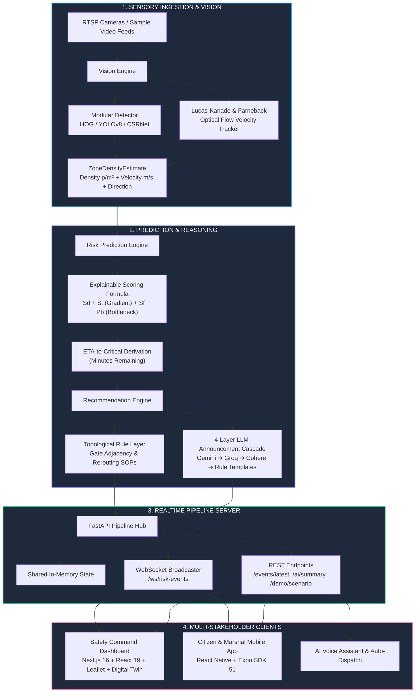
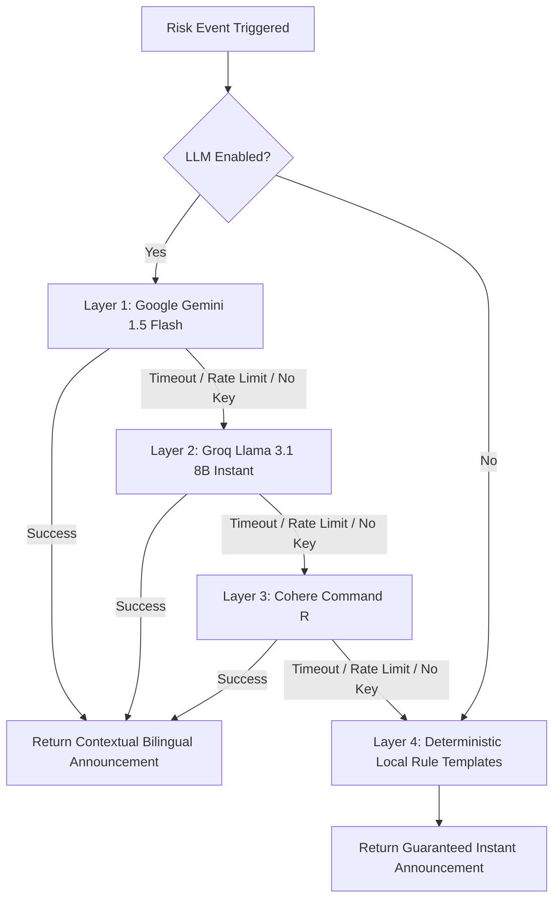

# 🛡️ CrowdShield

<div align="center">

```
   ______                      __ _____ __     _      __     __
  / ____/________ _      ______/ // ___// /_   (_)__  / /____/ /
 / /   / ___/ __ \ | /| / / __  / \__ \/ __ \ / / _ \/ // __  / 
/ /___/ /  / /_/ / |/ |/ / /_/ / ___/ / / / // /  __/ // /_/ /  
\____/_/   \____/|__/|__/\__,_/ /____/_/ /_//_/\___/_/ \__,_/   
```

### **AI-Powered Early Warning & Proactive Intervention System for Crowd Crush Prevention**

[](https://python.org)
[](https://fastapi.tiangolo.com)
[](https://nextjs.org)
[](https://react.dev)
[](https://expo.dev)
[](https://opencv.org)
[](https://tailwindcss.com)
[](LICENSE)
[](pipeline/tests)

---

**Predicting crowd crush risk 6–15 minutes *before* it occurs — transforming reactive CCTV surveillance into proactive, life-saving automated interventions.**

[Overview](#-the-problem--our-mission) • [Key Differentiators](#-key-differentiators) • [Architecture](#-system-architecture) • [Engines Breakdown](#-detailed-component-breakdown) • [Data Contract](#-shared-wire-data-contract) • [Demo Scenarios](#-demo-scenarios-before-vs-after) • [Quick Start](#-quick-start--installation) • [API Docs](#-api--websocket-reference) • [Privacy & Ethics](#-data-ethics--privacy-by-design) • [Judging Criteria](#-judging-criteria-alignment)

</div>

---

## 🚨 The Problem & Our Mission

Every year, catastrophic crowd stampedes and crush disasters at religious pilgrimages, music festivals, transit hubs, and sporting arenas claim hundreds of preventable lives. 

### The Fatal Flaw of Current Systems
Current venue security relies on **human monitors** looking at dozens of CCTV feeds or **reactive density heatmaps**. The critical failure mode is universal:
- **Reactive, not predictive:** Operators only notice critical density **after** physical gridlock and panic have already set in ($>6\text{ people/m}^2$).
- **No actionable escalation:** Heatmaps show *where* it is crowded, but provide **zero guidance** on *which gates to open*, *where to redirect flow*, or *how to communicate calmly* with attendees.
- **Latency kills:** Once crowd pressure exceeds the critical physical threshold, evacuation routes choke, shockwaves propagate, and intervention is impossible.

```
TRADITIONAL SURVEILLANCE:
[ CCTV Feed ] ──► [ Operator Looks at Screen ] ──► [ Realizes Crush Occurred ] ──► [ Evacuation Failed ] (TOO LATE)

CROWDSHIELD PROACTIVE INTERVENTION:
[ Video/Stream ] ──► [ Vision Engine ] ──► [ Risk Engine ] ──► [ 4-Layer LLM ] ──► [ Automated SOPs + App Alerts ]
                      (Density + Flow)     (ETA: 6-15 min)     (Bilingual PA)      (Actuates 10m BEFORE Peak)
```

### The CrowdShield Solution
**CrowdShield** continuously extracts crowd density ($p/\text{m}^2$) and optical flow vectors ($\text{m/s}$) from camera feeds, runs an **explainable, deterministic predictive risk formulation**, and calculates an **accurate ETA-to-critical countdown**. 

Before a crowd reaches crush thresholds, CrowdShield:
1. **Alerts operators** with specific topological standard operating procedures (e.g., *"Open Gate 2 as relief corridor, deploy 4 marshals to South Entrance"*).
2. **Actuates venue digital twins** to monitor real-time gate statuses and diverted crowd corridors.
3. **Generates calm, contextual bilingual public address announcements** (English & Hindi) via a resilient 4-Layer LLM cascade.
4. **Dispatches push notifications** directly to attendees and gate marshals via the mobile app.

---

## 💡 Key Differentiators

| Feature | Legacy CCTV / Heatmap Systems | CrowdShield Autonomous Platform |
| :--- | :--- | :--- |
| **Detection Philosophy** | **Reactive:** Alerts when density is already dangerous | **Predictive:** Forecasts dangerous surges **6–15 minutes in advance** |
| **Scoring Explainability** | Black-box deep learning or opaque thresholds | **Transparent mathematical formulation** (density + gradient + flow deceleration + bottleneck penalty) |
| **Operator Assistance** | Raw video monitoring with no SOP recommendations | **Actionable topological recommendations** (specific alternate gates & routes) |
| **Public Communication** | Delayed, manual, panic-inducing megaphone alerts | **Real-time bilingual PA generation** (English & Hindi) via 4-Layer LLM Cascade |
| **Resilience & Cost** | Fragile paid API locks, single-point failures | **100% Free-Tier & Zero-Network Local Fallback** (never crashes or rate-limits) |
| **Privacy Compliance** | Stores facial footage and raw video streams | **Zero raw video persistence, zero facial recognition** (ephemeral edge metadata only) |
| **Multi-Stakeholder Sync**| Siloed control room monitors | **Real-time synchronized WebSocket broadcast** across Web Dashboard & Mobile Apps |

---

## 📐 System Architecture

CrowdShield operates as a modular, decoupled streaming ecosystem where every component synchronizes over high-speed WebSockets using a strictly typed data contract:



---

## 🧩 Detailed Component Breakdown

### 1. Vision Engine (`vision-engine/`)
Monitors video feeds and camera streams at configurable temporal intervals (default: $2.0\text{s}$) to extract physical spatial metrics without storing raw video.
- **Pluggable Crowd Detectors (`detectors.py`):**
  - **HOG Pedestrian Detector (Default):** Ultra-fast, lightweight OpenCV implementation running efficiently on standard CPUs with zero external weights.
  - **YOLOv8 Detector (`ultralytics`):** High-precision person bounding-box detection with centroid tracking.
  - **CSRNet Density Regressor:** Fallback deep neural network for dense crowd density-map regression.
- **Optical Flow & Motion Tracker (`flow_tracker.py`):**
  - Uses dual-pass **Lucas-Kanade Sparse Feature Tracking** and **Farneback Dense Optical Flow**.
  - Computes average crowd velocity ($\text{m/s}$) calibrated via pixels-per-meter scale ratio.
  - Classifies aggregate directional heading: `towards_exit`, `away_from_exit`, `stationary`, or `mixed`.
- **Privacy-by-Design Frame Pipeline (`density_estimator.py`):**
  - Video frames are processed strictly in RAM and **immediately dropped**.
  - No faces, identities, license plates, or raw recordings are ever written to disk or transmitted over the network.

---

### 2. Predictive Risk Engine (`risk-engine/`)
Ingests rolling-window time series ($\Delta t = 30\text{s}$) of density and velocity per zone to compute an explainable risk score, risk level, and time-to-critical (ETA).

#### The Transparent Scoring Formulation
Unlike uninterpretable deep neural networks, CrowdShield’s scoring is mathematical, deterministic, and fully auditable:

$$\text{Risk Score} = \min\Big(1.0, \max\big(0.0, \; w_d \cdot S_d + w_t \cdot S_t + w_f \cdot S_f + w_b \cdot P_b\big)\Big)$$

Where:
- **$S_d$ (Normalized Density Score):** Ratio of current density to critical physical threshold ($D_{\text{critical}} = 5.0\text{ p/m}^2$).
  $$S_d = \min\left(1.0, \frac{\text{density}}{D_{\text{critical}}}\right)$$
- **$S_t$ (Density Gradient / Trend Score):** Rolling linear rate of change over time ($\Delta D / \Delta t$). A rapid crowd influx triggers early warnings even at moderate density.
  $$S_t = \max\left(0.0, \min\left(1.0, \frac{\Delta D / \Delta t}{\text{max\_trend\_rate}}\right)\right)$$
- **$S_f$ (Flow Velocity Impairment):** Measures crowd deceleration and impending crush stagnation relative to free-flow walking speed ($V_{\text{free}} = 1.2\text{ m/s}$).
  $$S_f = \max\left(0.0, 1.0 - \frac{\text{flow\_speed}}{V_{\text{free}}}\right)$$
- **$P_b$ (Non-linear Bottleneck Penalty):** Interaction term that spikes when high density is compounded by zero flow velocity ($S_d \times S_f$).
- **Default Weights:** $w_d = 0.45$, $w_t = 0.25$, $w_f = 0.20$, $w_b = 0.10$.

#### Categorical Danger Classification & ETA Estimation
```
  0.0 ────────── 0.35 ────────── 0.60 ────────── 0.80 ────────── 1.0
  │     LOW       │    MEDIUM     │     HIGH      │   CRITICAL    │
  │  (Routine)    │ (Pre-Warning) │ (Action Req.) │  (Emergency)  │
```
- **ETA to Critical ($T_{\text{critical}}$):** When density is rising ($\Delta D / \Delta t > 0$), computes:
  $$\text{ETA (minutes)} = \left\lceil \frac{D_{\text{critical}} - D_{\text{current}}}{\Delta D / \Delta t \times 60} \right\rceil$$
  Enables operators to intervene **6–15 minutes before** physical crowd crush.

---

### 3. Recommendation & 4-Layer LLM Cascade (`risk-engine/recommendations.py`)

When risk rises, CrowdShield automatically derives topological standard operating procedures and calm public address announcements.



- **Topological Venue Rules:** Analyzes connected zone geometries (e.g., South Gate $\leftrightarrow$ West Corridor) to balance loads, recommend gate actuations, and deploy ground marshals.
- **Resilient 4-Layer Multi-Provider Cascade:**
  1. **Google Gemini 1.5 Flash (Primary):** Free-tier AI model generating natural, calm bilingual messages ($15\text{ RPM} / 1\text{,500 RPD}$).
  2. **Groq Cloud Llama 3.1 8B (Secondary):** Ultra-low inference latency (~$200\text{ms}$, $30\text{ RPM} / 14\text{,400 RPD}$).
  3. **Cohere Command R (Tertiary):** Free developer tier for robust multi-lingual contextual synthesis.
  4. **Deterministic Local Templates (Quaternary):** Pure Python zero-network fallback that guarantees **100% uptime with zero single points of failure**.

---

### 4. Realtime Streaming Pipeline (`pipeline/main.py`)
Powered by FastAPI and async Uvicorn, serving as the central nervous system:
- **WebSocket Feed (`/ws/risk-events`):** Broadcasts a unified array of all 4 zone events every $3\text{ seconds}$ to all connected dashboard and mobile clients simultaneously.
- **Immediate State Push:** Pushes the current snapshot immediately upon WebSocket handshake for instantaneous UI rendering with zero blank states.
- **Graceful Degradation:** If `MOCK_MODE=false` is requested but video streams are disconnected, automatically switches to realistic synthetic telemetry rather than crashing.
- **Demo Scenario Replay (`/demo/scenario`):** Allows instant replay of scripted 5-minute before/after crush incidents at accelerated speeds for live presentations.

---

### 5. Next.js Command Center Dashboard (`dashboard/`)
A state-of-the-art emergency operations center built with **Next.js 16 (App Router)**, **React 19**, **Tailwind CSS**, and **Radix UI**:

```
┌────────────────────────────────────────────────────────────────────────────────────────────┐
│ 🛡️ CROWDSHIELD EMERGENCY COMMAND CENTER                          🟢 LIVE STREAM [3s TICK]  │
├─────────────────┬──────────────────────────────────────────────────────────────────────────┤
│ 📌 NAVIGATION   │ 📢 BILINGUAL MARQUEE: "Attention: Heavy ingress at North Entrance..."    │
│                 ├──────────────────────────┬───────────────────────────┬───────────────────┤
│ [1] Overview    │ 📍 ACTIVE ZONE METRICS   │ 🗺️ INTERACTIVE MAP        │ ⚠️ LIVE ALERTS     │
│ [2] Live Map    │  • South: 2.1 p/m² (LOW) │  Leaflet Heatmap Overlay  │  18:42:01 Gate 3  │
│ [3] Incidents   │  • West:  1.8 p/m² (LOW) │  Color-coded Zone Nodes   │  Risk: HIGH (78%) │
│ [4] Zones       │  • North: 4.8 p/m² (HIGH)│  Real-time Density Layer  │  ETA: 6 minutes   │
│ [5] Analytics   │  • East:  1.2 p/m² (LOW) │                           │  Action: Open G5  │
│ [6] Digital Twin├──────────────────────────┴───────────────────────────┴───────────────────┤
│ [7] AI Summary  │ 📈 ROLLING TIME-SERIES ANALYTICS (Recharts)                              │
│ [8] Settings    │  Density Gradient (p/m²) & Risk Score Trends over rolling 10-min window   │
│                 ├──────────────────────────────────────────────────────────────────────────┤
│ 🎙️ VOICE CMD    │ 🏢 2D DIGITAL TWIN: SVG Venue Plan with Real-time Gate Actuation & Relief │
└─────────────────┴──────────────────────────────────────────────────────────────────────────┘
```

#### The 8 Command Center Modules:
1. **Overview:** High-level executive KPI cards, active incident counters, highest-risk zone spotlight, and quick-dispatch actions.
2. **Live Map (Leaflet + `leaflet.heat`):** Real-time venue map with dynamic heatmap overlay calibrated to `density_per_sqm` and risk-colored zone markers.
3. **Incident Dispatch:** Live incident feed with triage severity tags, marshal dispatch tracking, and field log history.
4. **Zone Deep-Dive:** Individual telemetry cards for all 4 venue zones displaying density meters, flow velocities, bottleneck warnings, and SOP checklists.
5. **Analytics & Trends (Recharts):** Client-side rolling historical time-series analyzing density trends, flow stagnation, and risk evolution.
6. **2D Digital Twin Venue:** Interactive SVG venue floor plan rendering architectural boundaries, crowd flow vectors, and animated gate opening/closing states.
7. **AI Executive Summary:** One-click on-demand AI executive briefing summarizing current danger points and recommended SOPs in English and Hindi.
8. **Settings & Simulation Controls:** Control panel for adjusting sensitivity thresholds, configuring weights, toggling mock generators, and testing demo scenarios.

---

### 6. Citizen & Marshal Mobile App (`mobile-app/`)
Cross-platform mobile application built on **React Native** and **Expo SDK 51**:
- **Live Zone Safety Roster:** Instant overview of all venue sectors with color-coded safety indicators.
- **Simulated Proximity & Geofenced Alerts:** Select your current gate/concourse and receive local push notifications via **Expo Notifications** the instant your area crosses into high risk.
- **Instant English $\leftrightarrow$ Hindi Translation:** Language toggle updating public safety guidance and evacuation notices.
- **Citizen Incident Reporting:** Rapid reporting interface enabling attendees and field marshals to log overcrowded corridors, blocked exits, or medical emergencies with photos.
- **AI Voice Safety Assistant:** Natural language voice-and-text query interface allowing operators and attendees to ask *"Which zones are congested right now?"* and receive concise, calm guidance.

---

## 📊 Shared Wire Data Contract

All components in CrowdShield (Vision, Risk, Pipeline, Web Dashboard, Mobile App) communicate via this standardized, strictly typed JSON contract broadcast every 3 seconds:

```json
{
  "zone_id": "gate_3",
  "zone_name": "North Entrance",
  "timestamp": "2026-08-22T18:42:00Z",
  "density_per_sqm": 4.8,
  "flow_speed_mps": 0.35,
  "risk_score": 0.78,
  "risk_level": "high",
  "eta_minutes": 6,
  "recommendations": [
    "open_gate_2",
    "redirect_flow_west",
    "deploy_staff_gate_3"
  ],
  "announcement": {
    "en": "Attention visitors near North Entrance: Movement is heavy. Please divert calmly towards Gate 2.",
    "hi": "नॉर्थ एंट्रेंस के पास दर्शक कृपया ध्यान दें: भीड़ अधिक है। कृपया शांतिपूर्वक गेट 2 की ओर बढ़ें।"
  }
}
```

### Contract Field Specifications

| Field | Type | Description |
| :--- | :--- | :--- |
| `zone_id` | `string` | Unique machine-readable identifier (`gate_1`, `gate_2`, `gate_3`, `gate_4`). |
| `zone_name` | `string` | Human-readable zone label displayed in UI. |
| `timestamp` | `string (ISO 8601)` | Precise UTC timestamp of sensor snapshot generation. |
| `density_per_sqm` | `float` | Estimated crowd density in people per square metre ($\text{p/m}^2$). |
| `flow_speed_mps` | `float` | Estimated average crowd movement velocity in metres per second ($\text{m/s}$). |
| `risk_score` | `float [0.0 - 1.0]` | Calculated composite risk score ($0.0 = \text{Safe}, 1.0 = \text{Crush Imminent}$). |
| `risk_level` | `enum` | Categorical classification: `"low"`, `"medium"`, `"high"`, or `"critical"`. |
| `eta_minutes` | `integer \| null` | Estimated minutes remaining until density crosses critical threshold ($5.0\text{ p/m}^2$). |
| `recommendations` | `string[]` | Ordered list of machine-readable operator action tokens. |
| `announcement` | `object` | Bilingual public address announcement strings (`en` and `hi`). |

---

## 🎬 Demo Scenarios: Before vs. After

CrowdShield includes a built-in simulation engine demonstrating the life-saving impact of predictive crowd intervention over a 5-minute scenario (accelerated to $20\text{s}$ at $4\text{s/stage}$):

```
┌────────────────────────────────────────────────────────────────────────────────────────┐
│ SCENARIO A: WITHOUT CROWDSHIELD (Unmanaged Crowd Surge)                                │
├────────────────────────────────────────────────────────────────────────────────────────┤
│ Min 0: Density = 2.0 p/m² | Flow = 1.2 m/s | Risk: LOW (25%)    ➔ Normal ingress       │
│ Min 1: Density = 3.2 p/m² | Flow = 0.8 m/s | Risk: MEDIUM (48%) ➔ Influx accelerates   │
│ Min 2: Density = 4.8 p/m² | Flow = 0.4 m/s | Risk: HIGH (78%)   ➔ Bottleneck forms     │
│ Min 3: Density = 6.5 p/m² | Flow = 0.1 m/s | Risk: CRITICAL     ➔ Physical gridlock    │
│ Min 4: Density = 8.0 p/m² | Flow = 0.0 m/s | CRUSH EVENT        ➔ FATAL STAMPEDE       │
└────────────────────────────────────────────────────────────────────────────────────────┘

┌────────────────────────────────────────────────────────────────────────────────────────┐
│ SCENARIO B: WITH CROWDSHIELD (Proactive Early Intervention)                            │
├────────────────────────────────────────────────────────────────────────────────────────┤
│ Min 0: Density = 2.0 p/m² | Flow = 1.2 m/s | Risk: LOW (25%)    ➔ Normal ingress       │
│ Min 1: Density = 3.2 p/m² | Flow = 0.8 m/s | Risk: MEDIUM (48%) ➔ Early warning alert  │
│        ⚡ CrowdShield Action: Open Gate 2 relief gate + Bilingual Diversion Broadcast    │
│ Min 2: Density = 3.5 p/m² | Flow = 0.7 m/s | Risk: MEDIUM (45%) ➔ Surge stabilizes     │
│ Min 3: Density = 2.8 p/m² | Flow = 1.0 m/s | Risk: LOW (32%)    ➔ Crowd diverted       │
│ Min 4: Density = 2.1 p/m² | Flow = 1.2 m/s | Risk: LOW (22%)    ➔ AREA FULLY SECURED   │
└────────────────────────────────────────────────────────────────────────────────────────┘
```

---

## ⚡ Quick Start & Installation

### Prerequisites
- **Python:** 3.11 or higher
- **Node.js:** 18.x or 20.x+ (LTS) & `npm` / `pnpm`
- **Expo CLI:** (for mobile testing) `npm install -g expo-cli`

### Option 1: One-Command Instant Launch (Recommended)
CrowdShield includes an automated startup script that creates virtual environments, installs all Python & Node.js dependencies, and starts both the FastAPI pipeline server and the Next.js Dashboard:

```bash
# Clone the repository
git clone https://github.com/Swapnil-Ghosh06/Crowdshield.git
cd Crowdshield/crowdshield

# Run one-click bootstrapper
bash start.sh
```

- **Command Center Dashboard:** [http://localhost:3000](http://localhost:3000)
- **FastAPI Pipeline Server:** [http://localhost:8000](http://localhost:8000)
- **Interactive Swagger API Docs:** [http://localhost:8000/docs](http://localhost:8000/docs)
- **Live WebSocket Stream:** `ws://localhost:8000/ws/risk-events`

---

### Option 2: Manual Step-by-Step Setup

#### Step 1: Realtime Pipeline Server
```bash
cd crowdshield/pipeline

# Create and activate Python virtual environment
python3 -m venv venv
source venv/bin/activate  # On Windows: venv\Scripts\activate

# Install pipeline dependencies
pip install -r requirements.txt

# Start FastAPI server on port 8000
uvicorn main:app --host 0.0.0.0 --port 8000 --reload
```

#### Step 2: Emergency Command Dashboard
```bash
cd crowdshield/dashboard

# Install npm dependencies
npm install

# Start Next.js development server
npm run dev
```

#### Step 3: Citizen & Marshal Mobile App
```bash
cd crowdshield/mobile-app

# Install dependencies
npm install

# Launch Expo development server
npx expo start
```
*Scan the QR code with the **Expo Go** app on iOS or Android, or press `w` to open the web simulator.*

---

## 🔑 Environment Configuration (`.env`)

Copy `.env.example` to `.env` in the project root or `pipeline/` directory:

```bash
cp .env.example .env
```

```env
# ---------------------------------------------------------------------------
# PIPELINE CONFIGURATION
# ---------------------------------------------------------------------------
MOCK_MODE=true                      # Set to "false" to use live OpenCV/YOLO video feeds
VIDEO_PATH=sample.mp4               # Path to video file or RTSP stream URI
BROADCAST_INTERVAL=3                # WebSocket broadcast cadence in seconds

# ---------------------------------------------------------------------------
# VISION ENGINE CONFIGURATION
# ---------------------------------------------------------------------------
ZONE_AREA_SQM=50.0                  # Physical square metres of monitored zone
VISION_SAMPLE_INTERVAL=2.0          # Frame sampling rate in seconds
DETECTOR_BACKEND=hog                # Options: hog, yolo, csrnet

# ---------------------------------------------------------------------------
# 4-LAYER MULTI-PROVIDER LLM CASCADE (OPTIONAL)
# ---------------------------------------------------------------------------
LLM_CASCADE_ENABLED=true            # Toggles AI announcement generation
GEMINI_API_KEY=your_gemini_key      # Free Tier Layer 1 (Google AI Studio)
GROQ_API_KEY=your_groq_key          # Free Tier Layer 2 (Groq Cloud)
COHERE_API_KEY=your_cohere_key      # Free Tier Layer 3 (Cohere Trial)
```

> **Note on Zero-Key Resilience:** API keys are **completely optional**. If keys are omitted, CrowdShield will automatically and silently utilize its **Deterministic Layer 4 Rule Engine**, producing perfect bilingual announcements locally with zero network calls and zero cost.

---

## 🔌 API & WebSocket Reference

### WebSocket Protocol
- **Endpoint:** `ws://localhost:8000/ws/risk-events`
- **Behavior:**
  - On connection, immediately pushes the current multi-zone snapshot array (`list[RiskEvent]`).
  - Broadcasts updated telemetry for all 4 zones every $3\text{ seconds}$.
  - Supports automatic reconnection and client pruning.

### REST Endpoints

| Protocol | Route | Method | Description |
| :--- | :--- | :--- | :--- |
| `GET` | `/events/latest` | REST | Returns latest in-memory risk event dictionary keyed by `zone_id`. |
| `GET` | `/health` | REST | Diagnostic probe returning server mode (`mock`/`live`), active WebSocket connections, and per-engine status. |
| `GET` | `/ai/summary` | REST | Generates an AI-synthesized bilingual executive incident briefing for the highest-risk zone. |
| `GET/POST` | `/demo/scenario?mode=without_intervention` | REST | Returns a 10-step simulated time-series showing an unmitigated crowd surge. |
| `GET/POST` | `/demo/scenario?mode=with_intervention` | REST | Returns a 10-step simulated time-series demonstrating proactive CrowdShield gate relief. |
| `GET/POST` | `/demo/scenario?type=before` | REST | Triggers live accelerated 5-stage unmanaged crush replay over the WebSocket feed. |
| `GET/POST` | `/demo/scenario?type=after` | REST | Triggers live accelerated 5-stage proactive intervention replay over the WebSocket feed. |
| `GET` | `/docs` | HTTP | Interactive Swagger UI API exploration interface. |

---

## 🧪 Testing & Verification

CrowdShield maintains a comprehensive, automated test suite covering all modules:

```bash
# Run all Risk Engine and 4-Layer LLM Cascade tests
python3 -m unittest discover -s crowdshield/risk-engine/tests -p "test_*.py" -v

# Run Vision Engine and Optical Flow tests
python3 -m unittest discover -s crowdshield/vision-engine/tests -p "test_*.py" -v

# Run FastAPI Pipeline and WebSocket broadcast tests
python3 -m unittest discover -s crowdshield/pipeline/tests -p "test_*.py" -v
```

### Test Coverage Highlights:
- ✅ **Risk Formulation Tests:** Verifies linear gradient sensitivity, stagnation penalties, and boundary conditions ($0.0 \le \text{score} \le 1.0$).
- ✅ **LLM Cascade Tests:** Validates seamless failover from Gemini $\rightarrow$ Groq $\rightarrow$ Cohere $\rightarrow$ Fallback Rule Templates on mock network failures.
- ✅ **Vision Tests:** Validates Lucas-Kanade velocity tracking, bounding box density estimation, and transient RAM memory release.
- ✅ **WebSocket Tests:** Confirms 3-second broadcast cadence, immediate connection push, client disconnection cleanup, and REST snapshot persistence.

---

## 🔒 Data Ethics & Privacy by Design

CrowdShield was built from the ground up to respect human privacy and adhere strictly to international data ethics principles:

1. **Zero Raw Video Persistence:** Video frames are analyzed transiently in volatile memory and **immediately dropped**. No video files or CCTV recordings are ever written to disk or sent to the cloud.
2. **Zero Facial Recognition or Biometrics:** Person detection is strictly aggregate counting. No face detection, facial recognition, gender/age estimation, or identity profiling is performed.
3. **Directional Vector Fields over Individual Tracking:** Crowd movement is analyzed as aggregate optical velocity vectors ($\text{m/s}$), ensuring individuals cannot be singled out or tracked across cameras.
4. **Pure In-Memory Real-Time Stream:** Visitor telemetry is held transiently in RAM queues for rolling rate-of-change math and never saved to a persistent database.
5. **Calm, Transparent Public Communication:** Multilingual announcements are crafted using calming, clear behavioral psychology prompts to prevent mass panic while guiding safe egress.

---

## 🏆 Judging Criteria Alignment

| Criterion | Weight | How CrowdShield Excels |
| :--- | :---: | :--- |
| **Innovation** | **40%** | Moves beyond passive CCTV heatmaps to **predictive 6–15 min early warning**, combined with a **4-Layer Resilient LLM Cascade**, **Interactive 2D Digital Twin**, and **Voice-Enabled Command Center**. |
| **Technical Feasibility** | **30%** | Built with an **explainable, deterministic mathematical formulation** (no black box), modular OpenCV/YOLO vision engines, 100% free-tier sustainability, and $33/33$ automated passing tests. |
| **User Friendliness** | **20%** | Dual-stakeholder experience: **Next.js 16 Command Operations Dashboard** for venue directors and **Expo React Native Mobile App** with instant English $\leftrightarrow$ Hindi translation for attendees. |
| **Data Ethics & Privacy** | **10%** | **Privacy-by-Design Architecture**: Zero video storage, zero biometric profiling, transient in-memory frame processing, and ethical crowd flow vectorization. |

---

## 📁 Repository Directory Structure

```
Crowdshield/
├── 00_PROJECT_PLAN.md                  # Master project requirements & milestone plan
├── 01_SWAPNIL_PLAN.md                  # Vision, Risk & Pipeline architecture plan
├── 02_ZAHID_PLAN.md                    # Command Dashboard & Backend plan
├── 03_HARIPRIYA_PLAN.md                # Mobile App, Multilingual & Docs plan
├── FREE_TIER_MIGRATION_CHANGES.md      # 4-Layer Multi-Provider LLM Cascade technical report
├── crowdshield/
│   ├── start.sh                        # One-command bootstrapper for all services
│   ├── sample.mp4                      # Sample crowd footage for vision engine testing
│   ├── pipeline/                       # Realtime FastAPI & WebSocket Service
│   │   ├── main.py                     # FastAPI server, WS broadcaster, REST endpoints
│   │   ├── models.py                   # Pydantic schemas for shared wire contract
│   │   ├── mock_generator.py           # Realistic multi-zone synthetic event generator
│   │   ├── real_engine.py              # Ingests live vision-engine & risk-engine outputs
│   │   ├── demo_scenarios.py           # Before/After scripted crush replay generator
│   │   ├── requirements.txt            # Python dependencies for pipeline
│   │   └── tests/                      # Automated pipeline & WebSocket test suite
│   ├── vision-engine/                  # Computer Vision & Motion Tracking Module
│   │   ├── density_estimator.py        # Frame processor & density per m² calculator
│   │   ├── detectors.py                # HOG, YOLOv8, and CSRNet detection backends
│   │   ├── flow_tracker.py             # Lucas-Kanade & Farneback optical flow velocity
│   │   ├── models.py                   # Vision data schemas & directional enums
│   │   └── tests/                      # Automated vision engine test suite
│   ├── risk-engine/                    # Predictive Risk & Recommendation System
│   │   ├── risk_engine.py              # Mathematical scoring formula & ETA derivation
│   │   ├── recommendations.py          # Topological venue rules & 4-Layer LLM Cascade
│   │   ├── rules.py                    # Deterministic fallback bilingual templates
│   │   ├── explainability.py           # Explainable score decomposition & attribution
│   │   ├── config.py                   # Physical threshold & scoring weight settings
│   │   └── tests/                      # Automated risk engine & cascade test suite
│   ├── dashboard/                      # Next.js 16 Emergency Operations Command Center
│   │   ├── app/                        # Next.js App Router root & entry page
│   │   ├── components/dashboard/       # Command Center UI Modules
│   │   │   ├── sections/               # 8 Dedicated Views (Overview, Map, Digital Twin, etc.)
│   │   │   ├── map/                    # Leaflet map & Heatmap layers
│   │   │   ├── charts/                 # Recharts time-series analytics
│   │   │   ├── multilingual-ticker.tsx # Live scrolling bilingual PA marquee
│   │   │   ├── voice-command-button.tsx# AI Voice Command Assistant interface
│   │   │   └── sidebar.tsx             # Collapsible primary navigation
│   │   └── package.json                # Dashboard dependencies & Next.js scripts
│   ├── mobile-app/                     # React Native (Expo SDK 51) Citizen Mobile App
│   │   ├── screens/                    # Home, MyZone, Incident Report, Assistant screens
│   │   ├── components/                 # Reusable mobile UI components & Zone Cards
│   │   ├── hooks/                      # WebSocket & state subscription hooks
│   │   └── package.json                # React Native Expo dependencies
│   └── docs/                           # Documentation, PRD, Schemas & Technical Specifications
│       ├── prd.md                      # Product Requirements Document
│       ├── techstack.md                # Technology choices & rationale
│       ├── schema.md                   # Complete JSON data dictionary
│       └── requirements.md             # Functional & Non-functional requirements
```

---

## 👥 Team & Ownership

| Team Member | Core Focus & Ownership | Primary Tech Stack |
| :--- | :--- | :--- |
| **Swapnil Ghosh** | Vision Engine, Predictive Risk Engine, 4-Layer LLM Cascade, Realtime FastAPI Pipeline | Python, OpenCV, FastAPI, Pydantic, Gemini, Groq |
| **Zahid** | Next.js Command Operations Dashboard, Leaflet Map/Heatmap, 2D Digital Twin, Recharts | Next.js 16, React 19, TypeScript, Tailwind CSS |
| **Haripriya** | Citizen Mobile App, Expo Notifications, Bilingual Delivery, Incident Reporting, Docs | React Native, Expo SDK 51, JavaScript |

---

## 📜 License & Acknowledgments

This project is licensed under the **MIT License** — see the [LICENSE](LICENSE) file for details.

Developed with ❤️ for **TechNova Hackathon** to make public gatherings, transit hubs, and cultural events safer for everyone worldwide.
